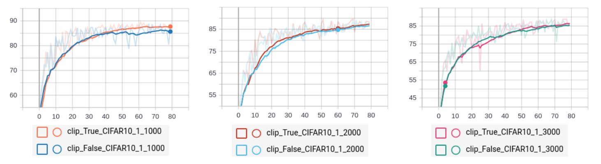
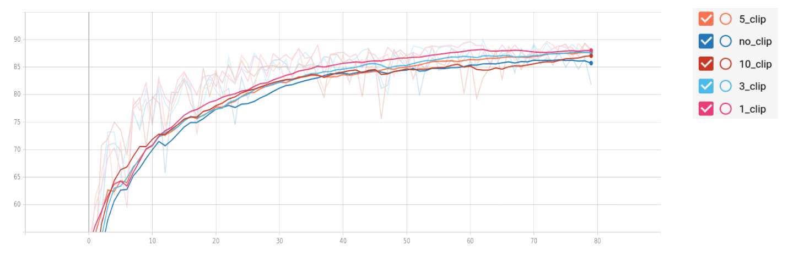

# LAMBC

This repository contains code for [LAMBC](https://arxiv.org/abs/2011.13584), an optimizer that trains with layer-wise adaptive learning rate. LAMBC improves upon [LAMB](https://arxiv.org/abs/1904.00962) by clipping the trust ratio which stabilizes its magnitude and prevent extreme values.

Experiments on image classification tasks (CIFAR-10 and down-sampled ImageNet-64) validate LAMBC's improvement over LAMB across different batch sizes and clipping bounds






## Installation

LAMBC requires the following:
* Linux
* Python 3.6 or later
* PyTorch 1.2 or later
* CUDA 10 or later

```
git clone https://github.com/jeffrey-fong/LAMBC.git
cd LAMBC
python main.py
```

## Usage

LAMBC can be used just like any other PyTorch optimizers.

```
optimizer = Lambc(model.parameters(), lr=0.001, weight_decay=0.0, betas=(.9, .999), adam=False, clip=True, clip_bound=1.0)
```

The boolean `clip` parameter decides whether clipping is enabled. LAMBC will perform just like the normal LAMB when the parameter is set to False. The `clip_bound` parameter determines the clipping bound for the trust ratio. In our experiments, the bound value of 1.0 provided the optimal performance (see figure above). However, we emphasize that the bound value will likely change according to the model used and the task complexity. Therefore, you will still need to optimize the hyperparameters depending on your specific problem.

## Citation

If you apply LAMBC to your research and project, please cite our work ([Improving Layer-wise Adaptive Rate Methods using Trust Ratio Clipping](https://arxiv.org/abs/2011.13584)):

```
@article{fong2020lambc,
  title={Improving Layer-wise Adaptive Rate Methods using Trust Ratio Clipping},
  author={Fong, Jeffrey and Chen, Siwei and Chen, Kaiqi},
  journal={arXiv preprint arXiv:2011.13584},
  year={2020}
}
```
